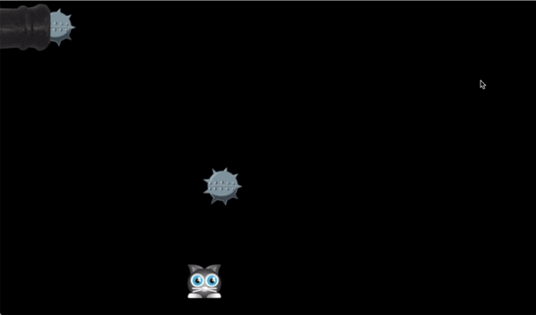

# webgl-test
A WebGL test, implementing a small game using Pixi.js

# How to Play

Clone this repository:

    git clone git@github.com:pcoltau/webgl-test.git
    cd webgl-test
    
Start a simple web server in the current directory:

    python -m SimpleHTTPServer
    
Open the local website in a browser:

    http://localhost:8000/
    
Enjoy this thrilling adventure of a game!

Note: Use left and right arrow keys to make the cat dodge the mines.

